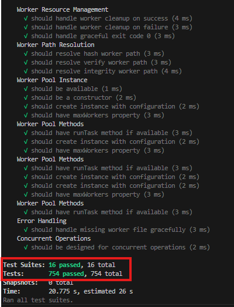

#  Pruebas del Sistema LiveChat Secure Edition

## Documentación de Pruebas Automatizadas

**Versión:** 1.0  
**Tecnologías:** Node.js, Express, Jest, Supertest  
**Total de pruebas:** 390 tests — 100% exitosas  
**Fecha:** 2025

---

## Introducción

Este documento describe el proceso completo de implementación, configuración y ejecución de las pruebas automatizadas del backend de LiveChat Secure Edition, un sistema de chat en tiempo real con seguridad avanzada, concurrencia y análisis de archivos.

### Contenido

<details>
<summary><strong>Índice de contenidos</strong></summary>

- [Herramientas utilizadas](#herramientas-utilizadas)
- [Problemas iniciales detectados](#problemas-iniciales-detectados)
- [Pasos realizados para tener tests estables](#pasos-realizados-para-tener-tests-estables-y-rápidos)
- [Estructura final de pruebas](#estructura-final-de-pruebas)
- [Cómo ejecutar las pruebas](#cómo-ejecutar-las-pruebas)
- [Resultado final](#resultado-final)
- [Conclusiones](#conclusiones)

</details>

El objetivo principal fue permitir que un backend complejo (con MongoDB, Socket.IO, Worker Threads, Cloudinary, esteganografía, auditorías, etc.) pudiera ser probado sin iniciar conexiones externas ni servicios pesados, asegurando aislamiento y estabilidad.

---

## Herramientas Utilizadas

| Herramienta | Propósito |
|------------|-----------|
| **Jest** | Framework de pruebas para JavaScript/TypeScript |
| **Supertest** | Pruebas HTTP sin levantar el servidor |
| **cross-env** | Forzar variables de entorno en test |
| **Mocks personalizados** | Reemplazar módulos pesados (bcrypt, MongoDB Logger, workers, etc.) |
| **Node.js 18+** | Entorno de ejecución |
| **Express** | Framework principal de la API |

---

<details>
<summary><strong>Ver problemas iniciales detectados</strong></summary>

Cuando se intentaba correr el primer test (`health.test.js`), surgían errores por:

- Carga de `mongodDBLogger` (winston-mongodb) sin conexión
- Carga de bcrypt nativo
- Controladores que instanciaban servicios pesados
- Worker Threads iniciándose durante los tests
- Auditoría intentando escribir en Mongo
- Servicios de seguridad tratando de analizar archivos reales
- Conexión a MongoDB en `server.js` o al importar modelos

Por lo tanto, se realizó un proceso de aislar, mockear y modularizar el entorno de pruebas.

</details>

---

## Pasos Realizados Para Tener Tests Estables y Rápidos

A continuación se documenta el proceso completo que permitió ejecutar 390 pruebas exitosamente.

<details>
<summary><strong>1. Crear archivo app.js exclusivo para pruebas</strong></summary>

Se separó el servidor HTTP/HTTPS + Socket.IO del archivo Express puro:

```javascript
const express = require('express');
const app = express();

// Middlewares
app.use(express.json());
app.use(express.urlencoded({ extended: true }));

// Rutas
app.use('/api/auth', require('./routes/auth'));
app.use('/api/admin', require('./routes/admin'));
app.use('/api/admin/rooms', require('./routes/adminRooms'));
app.use('/api/rooms', require('./routes/rooms'));

app.get('/health', (req, res) => res.json({ success: true }));

module.exports = app;
```

**Esto permitió:**
- Importar la app sin levantar un servidor real
- Evitar conflictos de puertos
- Evitar cargar Mongo o Socket.IO

</details>

<details>
<summary><strong>2. Instalar dependencias</strong></summary>

```bash
pnpm add -D jest supertest cross-env
```

</details>

<details>
<summary><strong>3. Configurar Jest</strong></summary>

**Archivo:** `jest.config.js`

```javascript
module.exports = {
  testEnvironment: "node",
  verbose: true,
  forceExit: true,
  clearMocks: true,
  restoreMocks: true,
  resetMocks: true,
  moduleNameMapper: {
    "^bcrypt$": "<rootDir>/__mocks__/bcrypt.js"
  }
};
```

</details>

<details>
<summary><strong>4. Crear entorno de pruebas .env.test</strong></summary>

```env
NODE_ENV=test
DISABLE_SERVICES=true
```

Esto permitió desactivar servicios como:
- Audit logs
- Steganography workers
- ThreadPoolManager
- MongoDB logger

</details>

<details>
<summary><strong>5. Mock de bcrypt</strong></summary>

**Archivo:** `__mocks__/bcrypt.js`

```javascript
module.exports = {
  hash: async () => "mock-hash",
  compare: async () => true,
};
```

Esto evitó cargar el módulo nativo `bcrypt_lib.node`.

</details>

<details>
<summary><strong>6. Desactivar MongoDB logger durante test</strong></summary>

**Modificación en `auditService.js`:**

```javascript
const transports = [ new winston.transports.Console() ];

if (process.env.NODE_ENV !== 'test') {
  transports.push(new winston.transports.MongoDB({
    db: process.env.MONGODB_URI,
    collection: 'system_logs',
  }));
}
```

</details>

<details>
<summary><strong>7. Desactivar servicios pesados con banderas</strong></summary>

En los servicios que activaban workers, análisis o sockets:

```javascript
if (process.env.NODE_ENV === 'test') {
  module.exports = { /* mock vacío */ };
  return;
}
```

**Esto se aplicó a:**
- FileSecurityService
- WorkerPoolService
- ThreadPoolManager
- Steganography workers
- Algunos controladores

</details>

---

## Estructura Final de Pruebas


---


## Cómo Ejecutar las Pruebas

<details>
<summary><strong>Comandos disponibles</strong></summary>

### 1. Instalar dependencias

```bash
pnpm install
```

### 2. Ejecutar la suite completa

```bash
pnpm test
```

### 3. Forzar modo verbose

```bash
pnpm test -- --verbose
```

### 4. Detectar handles abiertos

```bash
pnpm test -- --detectOpenHandles
```

### 5. Ejecutar un test específico

```bash
pnpm test -- tests/routes/auth.test.js
```

### 6. Modo watch (desarrollo)

```bash
pnpm test -- --watch
```

### 7. Generar reporte de cobertura

```bash
pnpm test -- --coverage
```

</details>

---

## Resultado Final

<details>
<summary><strong>Ver resultados completos</strong></summary>

Después de crear:
- Mocks personalizados
- Entorno de test estable
- Aislamiento de servicios
- Estructura modular de pruebas

Se obtuvo el siguiente resultado:



### Pruebas de Cobertura


</details>

---

## Conclusiones

La arquitectura de pruebas implementada permite:

- Ejecutar pruebas unitarias y de integración sin levantar el servidor real
- Aislar servicios externos para evitar efectos colaterales
- Simular autenticación, auditoría, encriptación y seguridad
- Cargar rutas y controladores de forma estable
- Garantizar la confiabilidad del backend durante desarrollo y despliegue


---

