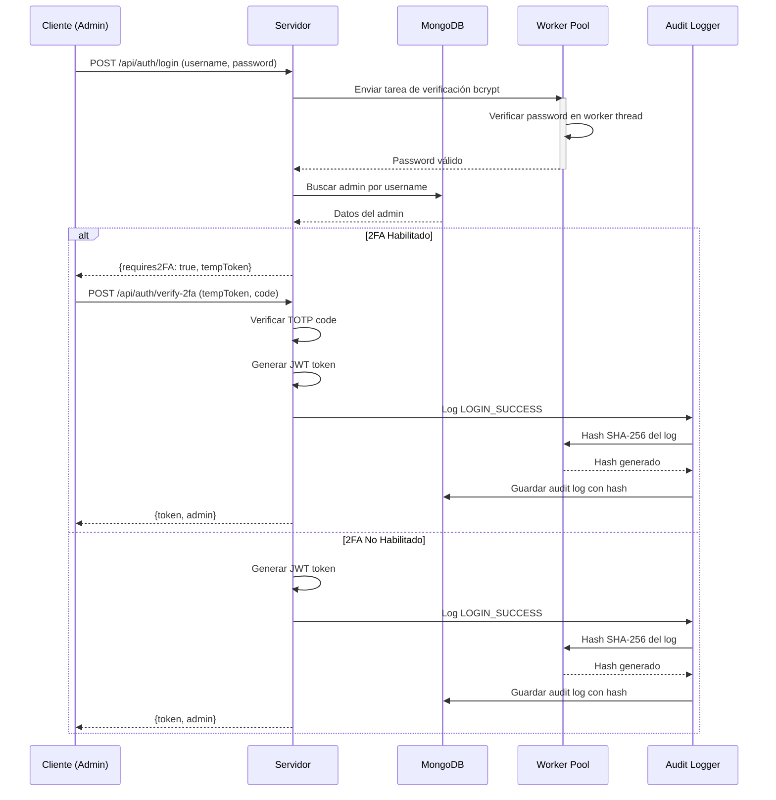
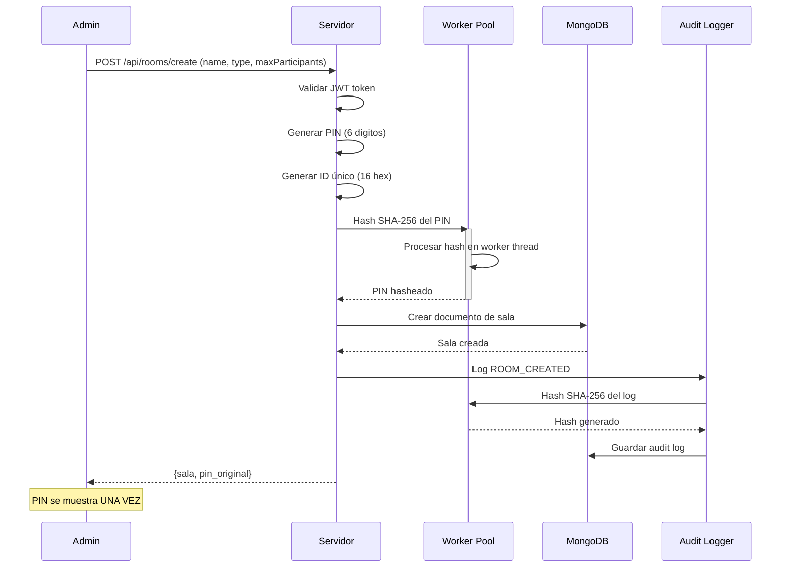
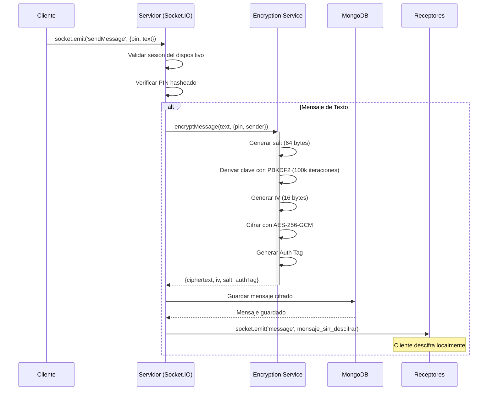
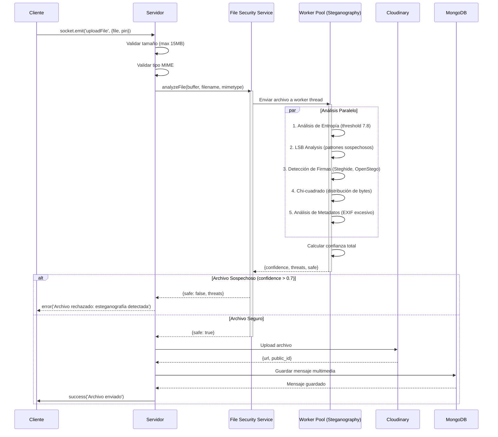
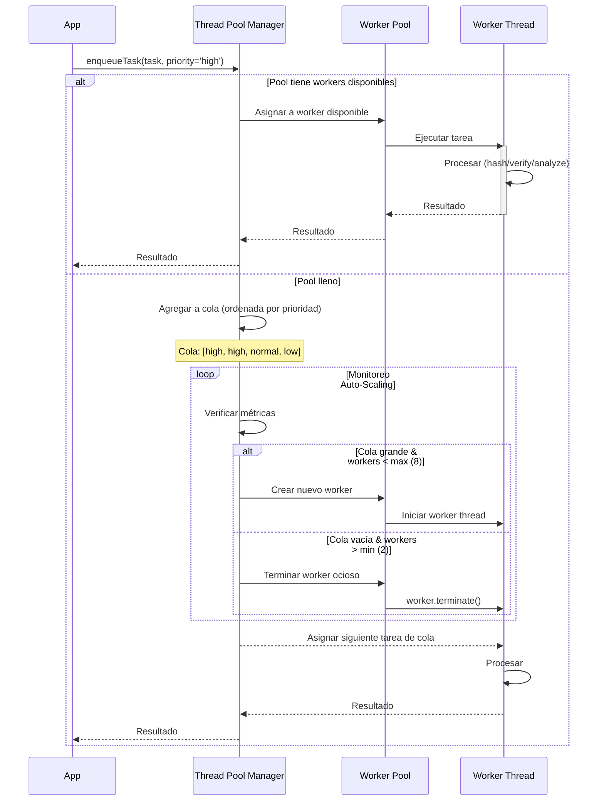
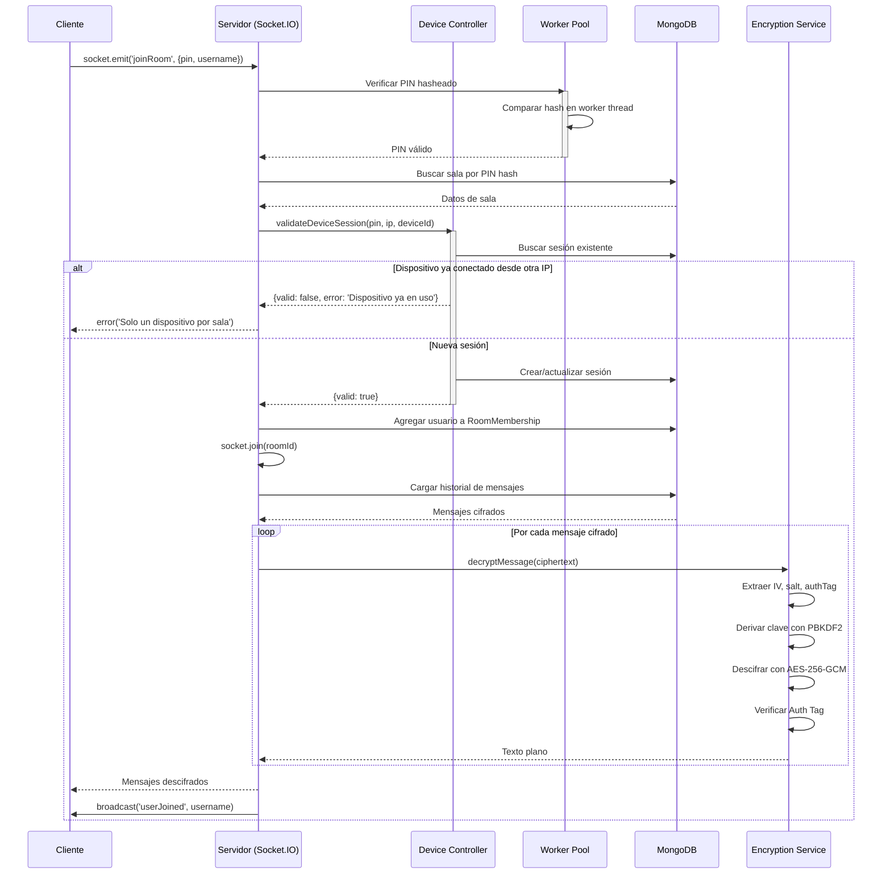

# LiveChat - Secure Edition

Sistema de chat en tiempo real con salas seguras, autenticación de administradores y múltiples características de seguridad.

Este proyecto fomenta el aprendizaje en programación concurrente, WebSockets para tiempo real, arquitectura cliente-servidor y desarrollo seguro, con énfasis en la detección de amenazas como la esteganografía.

**CI/CD Pipeline**: Análisis ML de vulnerabilidades + Tests automáticos + Deploy a producción

## Características Principales

### Seguridad
- **PIN Hasheado (SHA-256)**: Los PINs de sala nunca se almacenan en texto plano
- **ID Único Encriptado**: Cada sala tiene un identificador único de 16 caracteres hexadecimales
- **Cifrado de Mensajes AES-256-GCM**: Mensajes encriptados en reposo con PBKDF2 key derivation
- **Cifrado en Tránsito**: Socket.IO con soporte TLS/SSL para comunicación segura
- **Autenticación JWT**: Tokens seguros con expiración de 24 horas
- **2FA Opcional**: Autenticación de dos factores con TOTP (Google Authenticator)
- **Detección de Esteganografía**: 5 técnicas de análisis para archivos multimedia
- **Rate Limiting**: Protección contra ataques DDoS
- **Helmet**: Headers HTTP seguros
- **Audit Logging**: Logs con hash SHA-256 para no repudio
- **Control de Dispositivos**: Un dispositivo por sala, validación por IP

### Gestión de Salas
- **Creación por Admin**: Solo administradores pueden crear salas
- **Tipos de Sala**: Texto (solo mensajes) o Multimedia (archivos, imágenes, videos)
- **Persistencia**: Salas y mensajes guardados en MongoDB
- **Límite de Participantes**: 2-10 usuarios por sala
- **Auto-Expiración**: Salas vacías se eliminan automáticamente después de 1 hora
- **Gestión desde Panel Admin**: Ver, crear y eliminar salas

### Chat en Tiempo Real
- **Socket.IO**: Comunicación bidireccional en tiempo real
- **Cifrado End-to-End**: Mensajes cifrados con AES-256-GCM antes de guardarse en BD
- **Mensajes Persistentes**: Historial completo al unirse/reconectar (descifrado automático)
- **Archivos Multimedia**: Soporte para imágenes, videos, audio y documentos
- **Cloudinary**: Almacenamiento CDN para archivos
- **Validación de Archivos**: Límite de 15MB, tipos permitidos configurables
- **Reconexión Automática**: Sesión persistente al recargar página
- **Detección de Inactividad**: Desconexión automática con advertencia previa

### Concurrencia y Rendimiento
- **Worker Thread Pool**: Procesamiento paralelo de autenticación
- **Thread Pool Manager**: Auto-escalado de workers (2-8)
- **File Analysis Workers**: Análisis de archivos en threads separados
- **Lock Management**: Prevención de deadlocks
- **Métricas en Tiempo Real**: Estadísticas de utilización de workers

---

## Arquitectura

```
┌─────────────────────────────────────────────┐
│              LIVECHAT APP                   │
├─────────────────────────────────────────────┤
│                                             │
│  ┌──────────────┐      ┌──────────────┐   │
│  │   CLIENT     │◄────►│   SERVER     │   │
│  │              │      │              │   │
│  │ React + Nginx│      │ Node.js +    │   │
│  │   (Port 80)  │      │  Socket.IO   │   │
│  │              │      │  (Port 3001) │   │
│  └──────────────┘      └───────┬──────┘   │
│                                │           │
│                                ▼           │
│                        ┌──────────────┐   │
│                        │   MongoDB    │   │
│                        │ (Port 27017) │   │
│                        └──────────────┘   │
└─────────────────────────────────────────────┘
```

---

## Características

### Funcionalidades del Chat
- Sistema de salas con PIN único de 6 dígitos
- Límite de participantes configurable (2-10 personas)
- Mensajería instantánea con Socket.IO
- Control de dispositivo único por sala
- Lista de participantes en tiempo real
- Notificaciones de entrada/salida
- Interfaz intuitiva y responsive

### Características Técnicas
- **Seguridad** - Headers HTTP seguros, CORS configurado
- **Persistencia** - Datos guardados en MongoDB
- **Logs** - Sistema de logging estructurado
- **Concurrencia** - Worker threads para procesamiento paralelo

---

## Stack Tecnológico

### Frontend
- **React 19** - Framework de UI
- **Socket.IO Client** - WebSockets
- **PrimeReact** - Componentes UI
- **Lucide Icons** - Iconografía moderna
- **Nginx** - Servidor web de producción

### Backend
- **Node.js 18** - Runtime
- **Express** - Framework web
- **Socket.IO** - Comunicación en tiempo real
- **MongoDB** - Base de datos NoSQL
- **Mongoose** - ODM para MongoDB
- **Worker Threads** - Procesamiento concurrente
- **Crypto** - Encriptación AES-256-GCM

---

## Requisitos

- **Node.js 18+**
- **MongoDB 5.0+**
- **Cuenta de Cloudinary** (para almacenamiento de archivos multimedia)
- **Git** (para control de versiones)

---

## Inicio Rápido

### Configuración Inicial de Seguridad

**IMPORTANTE: Antes de iniciar el servidor, debes configurar las credenciales de seguridad.**

```bash
# 1. Clonar el repositorio
git clone <tu-repo>
cd LiveChat

# 2. Configurar el servidor
cd server
npm install

# 3. Generar claves de encriptación
node scripts/generateEncryptionKey.js

# 4. Configurar variables de entorno
cp .env.example .env
# Editar .env con las claves generadas y configuración de MongoDB/Cloudinary

# 5. Crear el primer administrador
node scripts/createAdmin.js

# 6. Iniciar MongoDB (en otra terminal)
mongod

# 7. Iniciar el servidor (Terminal 1)
cd server
npm run dev

# 8. Iniciar el cliente (Terminal 2)
cd client
npm install
npm start

# 9. Acceder a http://localhost:3000
```

---

## Diagramas de Secuencia

### 1. Flujo de Autenticación de Admin con 2FA



### 2. Flujo de Creación de Sala Segura



### 3. Flujo de Envío de Mensaje con Cifrado End-to-End



### 4. Flujo de Detección de Esteganografía en Archivos



### 5. Flujo de Gestión de Worker Thread Pool



### 6. Flujo de Conexión de Usuario a Sala



---

## Cómo Usar la Aplicación

### 1. Crear una Sala
- Ingresa un nombre de sala
- Define el límite de participantes (2-10)
- Se generará un PIN de 6 dígitos automáticamente
- Comparte el PIN con otros usuarios

### 2. Unirse a una Sala
- Ingresa el PIN de 6 dígitos de la sala
- Serás conectado automáticamente si hay espacio

### 3. Chatear
- Escribe mensajes en tiempo real
- Ve la lista de participantes activos
- Recibe notificaciones de entradas/salidas

---

## Configuración de Variables de Entorno

### Servidor (.env)

```bash
# MongoDB
MONGODB_URI=mongodb://localhost:27017/livechat

# Servidor
PORT=3001
FRONTEND_URL=http://localhost:3000
NODE_ENV=development

# Seguridad - Encriptación
ENCRYPTION_MASTER_KEY=<generado-por-generateEncryptionKey.js>
ENCRYPTION_ALGORITHM=aes-256-gcm

# JWT
JWT_SECRET=<tu-secreto-jwt-seguro>
JWT_EXPIRES_IN=24h

# Cloudinary
CLOUDINARY_CLOUD_NAME=<tu-cloud-name>
CLOUDINARY_API_KEY=<tu-api-key>
CLOUDINARY_API_SECRET=<tu-api-secret>

# Rate Limiting
RATE_LIMIT_WINDOW_MS=900000
RATE_LIMIT_MAX_REQUESTS=100

# Esteganografía
STEGANOGRAPHY_CONFIDENCE_THRESHOLD=0.7
```

### Cliente (.env)

```bash
REACT_APP_SOCKET_URL=http://localhost:3001
```

---

## Troubleshooting

### Puerto ya en uso

```bash
# Ver qué usa el puerto (Windows)
netstat -ano | findstr :3001

# Matar proceso
taskkill /PID <PID> /F
```

### MongoDB no se conecta

```bash
# Verificar que MongoDB esté corriendo
mongosh

# O iniciar servicio
net start MongoDB
```

### Frontend no se conecta al backend

1. Verifica `REACT_APP_SOCKET_URL` en `.env`
2. Verifica CORS en el backend
3. Reinicia ambos servidores

---


## Estructura del Proyecto

```
LiveChat/
├── client/                    # Frontend React
│   ├── src/
│   │   ├── components/        # Componentes React
│   │   │   ├── ChatRoom.js
│   │   │   ├── CreateRoom.js
│   │   │   ├── JoinRoom.js
│   │   │   ├── AdminLogin.js      # Login de admin con 2FA
│   │   │   └── AdminDashboard.js   # Panel de administración
│   │   ├── services/          # Socket.IO client
│   │   ├── styles/            # Estilos CSS
│   │   │   ├── AdminLogin.css
│   │   │   └── AdminDashboard.css
│   │   ├── utils/             # Utilidades
│   │   ├── AdminApp.js        # App de administración
│   │   └── App.js
│   └── package.json
├── server/                    # Backend Node.js
│   ├── controllers/           # Lógica de negocio
│   │   ├── DeviceSessionController.js
│   │   ├── RoomController.js
│   │   └── AuthController.js      # Autenticación de admins
│   ├── models/                # Modelos MongoDB
│   │   ├── DeviceSession.js
│   │   ├── Message.js         # Extendido con encriptación
│   │   ├── Room.js            # Extendido con tipos y seguridad
│   │   ├── Admin.js           # Modelo de administrador
│   │   └── AuditLog.js        # Logs de auditoría
│   ├── services/              # Servicios de seguridad
│   │   ├── auditService.js        # Winston logging
│   │   ├── encryptionService.js   # AES-256-GCM
│   │   ├── fileSecurityService.js # Validación de archivos
│   │   ├── threadPoolManager.js   # Gestión de concurrencia
│   │   └── workerPoolService.js   # Pools de workers
│   ├── workers/               # Worker Threads
│   │   ├── hashWorker.js          # Hash de contraseñas
│   │   ├── verifyWorker.js        # Verificación bcrypt
│   │   ├── integrityWorker.js     # Hashes SHA
│   │   └── steganographyWorker.js # Detección de esteganografía
│   ├── middleware/            # Middleware de seguridad
│   │   └── security.js            # Helmet, rate limiting, etc.
│   ├── routes/                # Rutas de API
│   │   ├── auth.js                # Autenticación
│   │   └── admin.js               # Panel de administración
│   ├── scripts/               # Scripts de utilidad
│   │   ├── createAdmin.js         # Crear administrador
│   │   ├── generateEncryptionKey.js # Generar claves
│   │   ├── encryptExistingMessages.js # Cifrar mensajes existentes
│   │   └── checkEncryptionStatus.js   # Verificar estado de cifrado
│   ├── config/
│   │   └── cloudinary.js
│   ├── utils/                 # Utilidades
│   ├── server.js              # Punto de entrada
│   ├── .env.example           # Template de configuración
│   └── package.json
├── SECURITY_IMPLEMENTATION.md # Documentación de seguridad
├── .gitignore
└── README.md                 # Este archivo
```

---

## Flujo de Trabajo de Desarrollo

### Desarrollo Diario

```bash
# 1. Iniciar MongoDB
mongod

# 2. Terminal 1 - Backend
cd server
npm run dev

# 3. Terminal 2 - Frontend
cd client
npm start

# Editas código → Nodemon reinicia automáticamente
```

### Agregar Nueva Característica

```bash
# 1. Crear rama
git checkout -b feature/nueva-caracteristica

# 2. Desarrollar y probar

# 3. Commit con mensaje descriptivo
git add .
git commit -m "feat: descripción de la característica"

# 4. Push a repositorio
git push origin feature/nueva-caracteristica
```

---

## Panel de Administración

### Acceso
Para acceder al panel de administración, integra `AdminApp.js` en tu enrutador principal:

```jsx
import React from 'react';
import { BrowserRouter, Routes, Route } from 'react-router-dom';
import App from './App'; // Tu app normal de chat
import AdminApp from './AdminApp'; // Panel de admin

function Root() {
  return (
    <BrowserRouter>
      <Routes>
        <Route path="/" element={<App />} />
        <Route path="/admin" element={<AdminApp />} />
      </Routes>
    </BrowserRouter>
  );
}

export default Root;
```

### Funcionalidades del Panel

#### Overview
- Métricas del servidor (uptime, memoria, CPU)
- Estado de los Worker Thread pools
- Utilización de workers globales, auth y file security
- Rendimiento (tiempo de espera, ejecución, pico de cola)

#### Logs de Auditoría
- Últimos 10 logs con actualización automática cada 10s
- Filtrado por admin, acción, estado, fecha
- Información detallada: IP, User-Agent, timestamp

#### Estado de Seguridad
- Verificación de funcionalidades activas
- Información de configuración de seguridad
- Alertas de configuraciones pendientes

### Autenticación 2FA

1. **Login inicial**: Usuario + contraseña
2. **Habilitar 2FA** (opcional):
   ```bash
   POST /api/auth/enable-2fa
   Authorization: Bearer <token>
   ```
   Retorna un QR code para Google Authenticator
3. **Login con 2FA**: Ingresa código de 6 dígitos

---

## API de Administración

### Endpoints de Autenticación

```bash
# Registrar nuevo admin
POST /api/auth/register
Content-Type: application/json
{
  "username": "admin",
  "email": "admin@example.com",
  "password": "StrongPass123!",
  "role": "superadmin"
}

# Login
POST /api/auth/login
{
  "username": "admin",
  "password": "StrongPass123!"
}
# Retorna: { requires2FA: true, tempToken: "..." } O { token: "..." }

# Verificar código 2FA
POST /api/auth/verify-2fa
{
  "tempToken": "...",
  "code": "123456"
}

# Habilitar 2FA
POST /api/auth/enable-2fa
Authorization: Bearer <token>
# Retorna: { qrCode: "data:image/png;base64,...", secret: "..." }
```

### Endpoints de Administración

```bash
# Obtener logs de auditoría (paginado)
GET /api/admin/logs?page=1&limit=20&action=LOGIN_SUCCESS&status=success
Authorization: Bearer <token>

# Verificar integridad de logs
POST /api/admin/logs/verify-integrity
Authorization: Bearer <token>
{
  "logIds": ["log_id_1", "log_id_2"]
}

# Obtener estadísticas del sistema
GET /api/admin/stats
Authorization: Bearer <token>

# Health check con stats de thread pools
GET /health
```

---

## Seguridad en Detalle

### 1. Encriptación de Mensajes (AES-256-GCM)

**Todos los mensajes de texto se cifran automáticamente antes de guardarse en la base de datos.**

#### Características del Cifrado:
- **Algoritmo**: AES-256-GCM (Galois/Counter Mode) con autenticación
- **Derivación de Clave**: PBKDF2 con 100,000 iteraciones usando SHA-512
- **IV Aleatorio**: 16 bytes generados con `crypto.randomBytes()`
- **Salt Único**: 64 bytes por mensaje para máxima seguridad
- **Auth Tag**: Verificación de integridad con tag de 16 bytes
- **Datos Adicionales Autenticados (AAD)**: PIN de sala y remitente

#### Flujo de Cifrado:

```javascript
// 1. Usuario envía mensaje
socket.emit('sendMessage', { pin: '123456', text: 'Hola mundo' });

// 2. Servidor cifra antes de guardar en BD
const encryptionResult = encryptionService.encryptMessage('Hola mundo', { 
  pin: '123456', 
  sender: 'Usuario' 
});
// Resultado: ciphertext en base64 con IV+Salt+AuthTag+Encrypted

// 3. Se guarda en MongoDB
await Message.create({ 
  text: encryptionResult.ciphertext,  // Texto cifrado
  encrypted: true,
  pin: '123456',
  sender: 'Usuario'
});

// 4. Al cargar mensajes, se descifran automáticamente
const messages = await Message.find({ pin: '123456' });
const decrypted = messages.map(msg => {
  if (msg.encrypted) {
    const result = encryptionService.decryptMessage(msg.text, {
      pin: msg.pin,
      sender: msg.sender
    });
    msg.text = result.plaintext;  // Texto descifrado
  }
  return msg;
});
```

#### Scripts de Utilidad:

```bash
# Verificar estado del cifrado en la BD
cd server
node scripts/checkEncryptionStatus.js

# Salida esperada:
# 📊 ESTADÍSTICAS DE MENSAJES:
# ──────────────────────────────────────────────────
#    Total de mensajes:           150
#    Mensajes de texto:           120
#    Mensajes cifrados:           120 ✅
#    Mensajes sin cifrar:         0 ⚠️
#    Porcentaje de cifrado:       100.00%

# Cifrar mensajes existentes (migración)
node scripts/encryptExistingMessages.js

# Salida:
# 🔐 Iniciando cifrado de mensajes existentes...
# ✅ Conectado a MongoDB
# 📊 Mensajes encontrados sin cifrar: 45
# ✓ Mensaje cifrado: 691b301a396d3f9a87b819c6...
# ...
# 📊 Resumen:
#    ✅ Mensajes cifrados exitosamente: 45
#    ❌ Mensajes con error: 0
```

#### Seguridad en Tránsito vs Reposo:

| Capa | Tecnología | Protege Contra |
|------|-----------|----------------|
| **Tránsito** | Socket.IO + TLS/SSL | Interceptación de red, MITM |
| **Reposo** | AES-256-GCM | Acceso no autorizado a BD, backups comprometidos |
| **Aplicación** | PBKDF2 + Salt | Rainbow tables, ataques de fuerza bruta |

#### Configuración de Clave Maestra:

```bash
# Generar clave de 256 bits (OBLIGATORIO en producción)
cd server
node scripts/generateEncryptionKey.js

# Copiar la salida a .env
# ENCRYPTION_MASTER_KEY=a1b2c3d4e5f6...

# ⚠️ IMPORTANTE: Guardar esta clave en un gestor de secretos seguro
# (AWS Secrets Manager, Azure Key Vault, HashiCorp Vault, etc.)
```

#### Ejemplo de Mensaje en MongoDB:

```javascript
// Texto plano original: "Hola mundo"
{
  "_id": ObjectId("691b301a396d3f9a87b819c6"),
  "pin": "214652",
  "sender": "Usuario",
  "text": "gKqWpJ4n2L8x...encrypted_base64...k9xF2Q==",  // Cifrado
  "encrypted": true,
  "messageType": "text",
  "timestamp": ISODate("2025-11-17T14:24:26.472Z")
}
```

Los mensajes se envían en **texto plano** a través de Socket.IO (ya protegido por TLS/SSL en producción), pero se **guardan cifrados** en la base de datos para protección en reposo.

### 2. Detección de Esteganografía

Archivos multimedia pasan por 5 análisis:

1. **Entropía**: Detecta datos comprimidos ocultos (threshold: 7.8 bits/byte)
2. **LSB Analysis**: Analiza patrones en Least Significant Bits
3. **Firmas Conocidas**: Detecta herramientas como Steghide, OpenStego
4. **Chi-cuadrado**: Anomalías en distribución de bytes
5. **Análisis de Imagen**: Metadatos excesivos, canales sospechosos

```bash
# Configurar threshold de rechazo (en .env)
STEGANOGRAPHY_CONFIDENCE_THRESHOLD=0.7  # 0-1, default 0.7
```

### 3. Gestión de Concurrencia

```javascript
// Worker Threads automáticos
const threadPool = require('./services/threadPoolManager');

// Ejecutar tarea CPU-intensiva
const result = await threadPool.enqueueTask(
  { operation: 'hash', data: password },
  'high' // priority: low, normal, high
);
```

### 4. Logs de Auditoría

Todas las acciones administrativas se registran:

```javascript
const auditService = require('./services/auditService');

// Registrar acción
await auditService.logLoginSuccess(adminId, ipAddress, userAgent);

// Verificar integridad
const isValid = await auditLog.verifyIntegrity();
```

---

## Checklist de Seguridad para Producción

- [ ] **SSL/TLS**: Certificado instalado (Let's Encrypt recomendado)
- [ ] **Firewall**: Solo puertos 80, 443 abiertos
- [ ] **Variables de entorno**: Claves generadas con `generateEncryptionKey.js`
- [ ] **MongoDB**: Autenticación habilitada, usuario con permisos limitados
- [ ] **Backups**: Configurar backups automáticos de MongoDB
- [ ] **Logs**: Rotar logs con logrotate o similar
- [ ] **Rate Limiting**: Configurado en `.env` según tu tráfico
- [ ] **2FA**: Habilitado para todos los administradores
- [ ] **Monitoreo**: Configurar alertas para errores críticos
- [ ] **Actualización**: Proceso para actualizar dependencias regularmente

---

## Documentación Adicional

- **[SECURITY_IMPLEMENTATION.md](./SECURITY_IMPLEMENTATION.md)** - Guía detallada de implementación de seguridad
- **Logs de Auditoría**: Ver `server/logs/` para archivos de log
- **Ejemplos de API**: Importar colección de Postman (crear según necesidad)

---

## Tips Importantes

1. **Seguridad**: Nunca commitees archivos `.env` al repositorio
2. **Claves**: Genera nuevas claves de encriptación para cada entorno
3. **Workers**: El pool se auto-escala según la carga (2-8 workers)
4. **Logs**: Revisa los audit logs regularmente para detectar actividad sospechosa
5. **Archivos**: La detección de esteganografía funciona con 5 técnicas paralelas
6. **Mensajes**: Todos los mensajes de texto se cifran automáticamente con AES-256-GCM

---

## Licencia

Este proyecto está desarrollado por **Autepim**.

---

**Desarrollado con ❤️ por Autepim**




