# Vulnerability Detection

Sistema de deteccion de vulnerabilidades multilenguaje con arquitectura de dos etapas SEMMA.

## 📊 Resumen

**Evaluacion total en modelos**: **13,968 muestras de codigo**
- Modelo 1 (Detector): 9,312 muestras
- Modelo 2 (Clasificador): 4,656 muestras

- **Modelo 1**: Deteccion binaria (79.01% accuracy, 90.12% recall)
- **Modelo 2**: Clasificacion CWE multiclase (86.94% accuracy, 5-fold CV: 87.62%)

---

## 🎯 Caracteristicas

- **Deteccion binaria (Modelo 1)**: Vulnerable o seguro (9,312 muestras)
- **Clasificacion multiclase (Modelo 2)**: 10 tipos de vulnerabilidad CWE (4,656 muestras)
- **Multilenguaje**: Soporta 11 lenguajes de programacion
- **ML basado en TF-IDF**: Procesamiento eficiente de codigo
- **Arquitectura SEMMA**: 5 fases sistematicas (Sample → Explore → Modify → Model → Assess)
- **K-Fold Cross-Validation**: Validacion cruzada estratificada (5-fold) en ambos modelos
- **API Flask**: REST API productiva con logging y manejo de errores

## 🗣️ Lenguajes soportados

C++, Python, Java, JavaScript, C#, PHP, Ruby, Swift, Go, Kotlin, Fortran

---

## 📁 Estructura del proyecto

```
CVEfixes-SEMMA-Analysis/
├── LICENSE
├── README.md (este archivo)
├── .gitignore
│
├── data/
│   └── processed/
│       ├── cybernative_detector_training.csv        (9,312 muestras)
│       └── securityeval_cwe_training.csv           (4,656 muestras)
│
├── models/                                           (6 artefactos .pkl)
│   ├── vulnerability_detector.pkl                  (Modelo 1)
│   ├── vectorizer_detector.pkl                     (TF-IDF bigramas)
│   ├── language_encoder.pkl                        (11 lenguajes)
│   ├── metrics_vulnerability_detector.txt          (Metricas Modelo 1)
│   ├── cwe_classifier.pkl                          (Modelo 2)
│   ├── vectorizer_cwe_classifier.pkl              (TF-IDF trigramas)
│   ├── cwe_encoder.pkl                            (10 tipos CWE)
│   └── metrics_cwe_classifier.txt                 (Metricas Modelo 2)
│
├── modelo_1_detector/
│   └── vulnerability_detector.py                  (Script de entrenamiento)
│
├── modelo_2_clasificador/
│   └── cwe_classifier.py                          (Script de entrenamiento)
│
├── backend/
│   ├── app.py                                     (API Flask)
│   ├── client.py                                  (Cliente Python)
│   ├── requirements.txt
│   └── README.md
│
└── test/
    ├── test_api.py                                (18 tests)
    ├── effectiveness_test.py                      (10 tests)
    └── samples.py                                 (38 ejemplos reales)
```

---

## 📊 Datasets

### Modelo 1 - Dataset de deteccion binaria

| Aspecto | Descripcion |
|---------|-----------|
| **Fuente** | CyberNative DPO (Hugging Face Security Dataset) |
| **Archivo** | `data/processed/cybernative_detector_training.csv` |
| **Total muestras** | 9,312 |
| **Distribucion** | 50% vulnerable (4,656) + 50% seguro (4,656) |
| **Estado** | ✅ BALANCEADO |
| **Lenguajes** | 11 (distribucion ~9% cada uno) |
| **Longitud promedio** | 461 caracteres (rango: 55-8,925) |
| **Valores nulos** | 0 |
| **Duplicados** | 7 (removidos durante procesamiento) |

### Modelo 2 - Dataset de clasificacion CWE

| Aspecto | Descripcion |
|---------|-----------|
| **Fuente** | SecurityEval Dataset (codigo vulnerable consolidado) |
| **Archivo** | `data/processed/securityeval_cwe_training.csv` |
| **Muestras originales** | 4,656 (solo codigo vulnerable de Modelo 1) |
| **Muestras procesadas** | 3,715 (filtrando clases con <2 muestras) |
| **Tipos CWE originales** | 937 categorias |
| **Tipos CWE consolidados** | 10 categorias principales |
| **Clases finales** | 21 clases (despues de filtracion) |
| **Consolidacion ejemplo** | CWE-120 + CWE-121 + CWE-122 → "Buffer Overflow" |

---

## 🤖 Modelos ML

### Modelo 1: Vulnerability Detector (Detector Binario)

**Proposito**: Clasificacion binaria - ¿Es este codigo vulnerable?

**Arquitectura**:
```
Entrada: Codigo fuente + Lenguaje
    ↓
Vectorizacion TF-IDF:
  - Max features: 1,000
  - N-gramas: (1, 2) = unigramas + bigramas
  - Stop words: English
  - Sublinear TF scaling: True
    ↓
Language Encoding:
  - 11 lenguajes → 1 feature numerico
    ↓
RandomForest Classifier:
  - N estimators: 200 arboles
  - Max depth: 25
  - Min samples split: 5
  - Estrategia split: stratified (mantiene proporciones)
    ↓
Salida: Prediccion (0=Seguro, 1=Vulnerable) + Probabilidades
```

**Features**: 1,001 totales (1,000 TF-IDF + 1 language)

**Performance**:

| Metrica | Valor | Interpretacion |
|---------|-------|-----------------|
| **Accuracy (Test)** | 79.01% | 7,901 de 10,000 correctos |
| **Precision** | 73.73% | De 1,000 predichas vulnerables, 737 correctas |
| **Recall** | 90.12% | De 1,000 reales vulnerables, 901 detectadas ✅ CRITICO |
| **F1-Score** | 81.10% | Balance precision-recall |
| **ROC-AUC** | 88.83% | Excelente separacion de clases |
| **5-Fold CV** | 79.22% ± 0.26% | Consistencia alta, bajo overfitting |
| **Overfitting** | 6.80% | Aceptable |

**Matriz de confusion (Test: 1,863 muestras)**:
```
                Predicho Negativo  Predicho Positivo
Real Negativo          633                299         (932 total)
Real Positivo           92                839         (931 total)
```

**Analisis**:
- 🟢 **True Negatives (633)**: Codigo seguro identificado correctamente
- 🔴 **False Positives (299)**: Falsa alarma (codigo seguro = vulnerable)
- 🔴 **False Negatives (92)**: ERROR CRITICO - vulnerabilidad NO detectada
- 🟢 **True Positives (839)**: Vulnerabilidad detectada correctamente

**Datos de entrenamiento**:
- Train: 7,449 muestras (80%)
- Test: 1,863 muestras (20%)

---

### Modelo 2: CWE Classifier (Clasificador Multiclase)

**Proposito**: Clasificacion multiclase - ¿Que tipo de vulnerabilidad es?

**Arquitectura**:
```
Entrada: Codigo vulnerable + Lenguaje
    ↓
Vectorizacion TF-IDF:
  - Max features: 1,200
  - N-gramas: (1, 3) = unigramas + bigramas + trigramas
  - Stop words: English
  - Sublinear TF scaling: True
    ↓
RandomForest Classifier:
  - N estimators: 250 arboles
  - Max depth: 15
  - Min samples split: 2
  - Class weight: balanced (ajusta por desbalance de clases)
  - Estrategia split: stratified (mantiene proporciones)
    ↓
K-Fold Cross-Validation:
  - Estrategia: StratifiedKFold (5 folds)
  - Proporciones: Mantiene distribucion de clases en cada fold
    ↓
Salida: Prediccion (10 tipos CWE) + Probabilidades
```

**Features**: 1,200 (TF-IDF trigramas)

**Performance**:

| Metrica | Valor | Interpretacion |
|---------|-------|-----------------|
| **Accuracy (Test)** | 86.94% | Excelente clasificacion |
| **Precision (Avg)** | 87.83% | Pocas falsos positivos |
| **Recall (Avg)** | 86.94% | Detecta la mayoria de tipos |
| **F1-Score** | 87.04% | Balance excelente |
| **5-Fold CV** | 87.62% ± 0.60% | Muy consistente y robusto |
| **Overfitting** | 5.28% | BAJO - Excelente generalizacion |

**Distribucion de tipos CWE (10 categorias)**:

| Rango | Tipo CWE | Muestras | % | Representacion |
|-------|----------|----------|---|-----------------|
| 1️⃣ | Buffer Overflow | 1,350 | 36.4% | ████████████████ |
| 2️⃣ | SQL Injection | 634 | 17.1% | ████████ |
| 3️⃣ | Code Injection | 583 | 15.7% | ███████ |
| 4️⃣ | XSS (Cross-Site Scripting) | 219 | 5.9% | ███ |
| 5️⃣ | Null Pointer / Null Safety | 366 | 9.8% | █████ |
| 6️⃣ | Insecure Deserialization | 184 | 4.9% | ██ |
| 7️⃣ | Memory Management | 163 | 4.4% | ██ |
| 8️⃣ | Improper Input Validation | 148 | 4.0% | ██ |
| 9️⃣ | Format String Attack | 32 | 0.9% | ▌ |
| 🔟 | Uninitialized Variables | 36 | 1.0% | ▌ |

**Datos de entrenamiento**:
- Train: 2,972 muestras (80%)
- Test: 743 muestras (20%)
- Total: 3,715 procesadas (de 4,656 originales)

---

## 🔄 Diagrama de flujo - Pipeline completo

```mermaid
graph TD
    A["📝 Codigo fuente"] -->|Input| B["MODELO 1: Detector Binario"]
    
    B -->|Vectorizacion| B1["TF-IDF 1000 bigramas<br/>+ Language encoding<br/>= 1,001 features"]
    B1 -->|RandomForest 200| B2["Prediccion binaria"]
    B2 -->|Output| B3{"¿Vulnerable?"}
    
    B3 -->|NO| C["🟢 SEGURO<br/>Confianza: 90.12%"]
    B3 -->|SI| D["⚠️ VULNERABLE<br/>Confianza: 79.01%"]
    
    D -->|Pasar a| E["MODELO 2: CWE Classifier"]
    E -->|Vectorizacion| E1["TF-IDF 1200 trigramas<br/>= 1,200 features"]
    E1 -->|RandomForest 250| E2["Prediccion multiclase"]
    E2 -->|Output| E3["🔴 Tipo CWE<br/>Confianza: 86.94%"]
    
    E3 -->|Buffer Overflow| F1["CWE-120/121/122"]
    E3 -->|SQL Injection| F2["CWE-89"]
    E3 -->|Code Injection| F3["CWE-94/95"]
    E3 -->|XSS| F4["CWE-79"]
    E3 -->|Otros| F5["6 categorias mas"]
    
    C -->|API Response| G["📡 JSON Output"]
    E3 -->|API Response| G
    
    G -->|Estructura| H["{ vulnerable: boolean,<br/>tipo: string,<br/>confianza: float,<br/>probabilidades: dict }"]
    
    style A fill:#e1f5ff
    style B fill:#fff3e0
    style C fill:#c8e6c9
    style D fill:#ffcdd2
    style E fill:#f3e5f5
    style E3 fill:#ffcdd2
    style G fill:#e0f2f1
```



---

## 🚀 Como usar

### Opcion 1: API Flask (RECOMENDADO) ⭐

```bash
cd backend
pip install -r requirements.txt
python app.py
```

Accede a `http://localhost:5000/info`

**Endpoints**:
- `POST /analyze` - Analisis completo (detectar + clasificar)
- `POST /detect` - Solo deteccion binaria
- `POST /classify` - Solo clasificacion CWE
- `GET /languages` - Lenguajes soportados
- `GET /cwe-types` - Tipos de vulnerabilidad
- `GET /health` - Verificar salud API

**Ejemplo con curl**:
```bash
curl -X POST http://localhost:5000/analyze \
  -H "Content-Type: application/json" \
  -d '{
    "codigo": "char buffer[10]; strcpy(buffer, user_input);",
    "lenguaje": "C++"
  }'
```

**Respuesta esperada**:
```json
{
  "deteccion": {
    "vulnerable": 1,
    "confianza": 0.87,
    "probabilidades": {
      "seguro": 0.13,
      "vulnerable": 0.87
    }
  },
  "clasificacion": {
    "tipo_vulnerabilidad": "Buffer Overflow",
    "confianza": 0.92,
    "top_3_tipos": [
      ["Buffer Overflow", 0.92],
      ["SQL Injection", 0.03],
      ["Code Injection", 0.02]
    ]
  }
}
```

### Opcion 2: Ejecutar scripts de entrenamiento

```bash
# Entrenar Modelo 1 (9,312 muestras, ~5-6 segundos con K-Fold)
cd modelo_1_detector
python vulnerability_detector.py

# Entrenar Modelo 2 (3,715 muestras, ~20 segundos con K-Fold)
cd modelo_2_clasificador
python cwe_classifier.py
```

### Opcion 3: Usar modelos en Python

```python
import pickle
import numpy as np

# Cargar Modelo 1
detector = pickle.load(open('models/vulnerability_detector.pkl', 'rb'))
vectorizer = pickle.load(open('models/vectorizer_detector.pkl', 'rb'))
lang_encoder = pickle.load(open('models/language_encoder.pkl', 'rb'))

# Codigo a analizar
codigo = "SELECT * FROM users WHERE id = " + user_input
lenguaje = "Python"

# Prediccion
features = vectorizer.transform([codigo])
is_vulnerable = detector.predict(features)[0]
confidence = detector.predict_proba(features)[0]

print(f"Vulnerable: {bool(is_vulnerable)}")
print(f"Confianza: {confidence[is_vulnerable]:.2%}")

# Si vulnerable, clasificar tipo CWE
if is_vulnerable:
    cwe_classifier = pickle.load(open('models/cwe_classifier.pkl', 'rb'))
    vectorizer_cwe = pickle.load(open('models/vectorizer_cwe_classifier.pkl', 'rb'))
    cwe_encoder = pickle.load(open('models/cwe_encoder.pkl', 'rb'))
    
    features_cwe = vectorizer_cwe.transform([codigo])
    cwe_type_idx = cwe_classifier.predict(features_cwe)[0]
    cwe_type = cwe_encoder.inverse_transform([cwe_type_idx])[0]
    
    print(f"Tipo CWE: {cwe_type}")
```

---

## 📊 Comparativa de modelos

| Aspecto | Modelo 1 (Detector) | Modelo 2 (Clasificador) |
|--------|-------------------|----------------------|
| **Tarea** | Binario (Vulnerable/Seguro) | Multiclase (10 CWE tipos) |
| **Datos** | 9,312 muestras | 3,715 muestras (filtradas) |
| **Proporcion** | 50/50 balanceado | Desbalanceado (Buffer Overflow 36%) |
| **Features** | 1,001 (TF-IDF bigramas) | 1,200 (TF-IDF trigramas) |
| **RandomForest** | 200 arboles | 250 arboles |
| **Test Accuracy** | 79.01% | 86.94% ⭐ Mejor |
| **Recall** | 90.12% ⭐ Mejor | 86.94% |
| **5-Fold CV** | 79.22% ± 0.26% | 87.62% ± 0.60% |
| **Overfitting** | 6.80% | 5.28% ⭐ Mejor |
| **Tiempo entrenamiento** | ~6 seg (con K-Fold) | ~20 seg (con K-Fold) |
| **Uso en produccion** | Etapa 1 (filtro rapido) | Etapa 2 (clasificacion profunda) |

---

## 🎓 Metodologia SEMMA

Ambos modelos siguen **SAS SEMMA Methodology** con 5 fases:

1. **SAMPLE**: Cargar datos, validar estructura, inspeccionar distribucion
2. **EXPLORE**: Analizar estadisticas, detectar outliers, distribucion de clases
3. **MODIFY**: Feature engineering, normalizacion, transformacion de datos
4. **MODEL**: Seleccionar algoritmo, entrenar, tuning de hiperparametros
5. **ASSESS**: Evaluar metricas, validacion cruzada, analisis de generalizacion

---

## 📁 Estructura de artefactos generados

```
models/
├── vulnerability_detector.pkl           (26.3 MB - Modelo 1)
├── vectorizer_detector.pkl              (1.2 MB - TF-IDF bigramas)
├── language_encoder.pkl                 (0.05 KB - 11 lenguajes)
├── metrics_vulnerability_detector.txt   (0.3 KB)
├── cwe_classifier.pkl                   (31.8 MB - Modelo 2)
├── vectorizer_cwe_classifier.pkl        (1.8 MB - TF-IDF trigramas)
├── cwe_encoder.pkl                      (0.1 KB - 10 CWE tipos)
└── metrics_cwe_classifier.txt           (0.5 KB)

Total: ~62.8 MB (modelos + vectorizadores)
```

---

## 🔍 Validacion y testing

```bash
# Ejecutar tests de API
cd test
python test_api.py              # 18 tests (85% pass rate)

# Ejecutar tests de efectividad
python effectiveness_test.py    # 10 tests (80% pass rate)

# Ver ejemplos reales de codigo
python samples.py               # 38 ejemplos (11 lenguajes)
```

---
